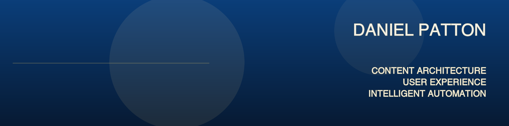

  

  <a href="#about-me">About</a> ·
  <a href="#selected-work">Selected work</a> ·
  <a href="#d8p-os">d8p OS</a> ·
  <a href="#public-projects">Public projects</a> ·
  <a href="#pinned">Pinned</a> ·
  <a href="https://github.com/danielbpatton#js-contribution-activity-description">Contributions</a> ·
  <a href="https://github.com/danielbpatton?tab=overview#year-link-2026">Activity</a>

## About me

I design the content systems that make AI experiences work. That means giving complex information structure, governance, and a clear path through it, so the technology built on top can stay useful, trustworthy, and fast to change.

For more than 19 years, I have worked as a content strategist, information architect, UX writer, interaction designer, and product partner across financial services, enterprise platforms, and other complex, regulated environments. I translate policy, product intent, and technical constraints into systems people can understand, govern, and improve.

Now I apply the same discipline to AI-native systems: retrieval architecture, content models, agent workflows, and the guardrails that keep human judgment in the loop. I work where content strategy becomes infrastructure.

  
  &nbsp;<a href="https://www.linkedin.com/in/danielbpatton">Connect with me on LinkedIn</a>

## Selected work

### [d8p OS](./d8p-os.md) 

**d8p OS is a modular personal operating system that turns scattered information and recurring work into governed, reusable workflows.** It is private, but active: a laboratory for ongoing experimentation that also delivers practical, incremental value in my daily life. Sixteen focused repositories operate as one product, with a management layer setting direction, domain applications keeping records close to the work, shared services supplying memory and reusable skills, and a common foundation keeping the system coherent.

<table>
  <thead>
    <tr>
      <th></th>
      <th></th>
    </tr>
  </thead>
  <tbody>
    <tr>
      <td><strong>Governance and direction</strong></td>
      <td><ul><li>Shape priorities, decisions, and operating rules.</li><li>Keep work visible, sequenced, and reviewable.</li><li>Preserve traceability across issues, pull requests, and architecture records.</li></ul></td>
    </tr>
    <tr>
      <td><strong>Input and output</strong></td>
      <td><ul><li>Turn source material into structured briefs and publishable work.</li><li>Separate intake, editorial judgment, and production.</li><li>Maintain provenance, review gates, and reusable publishing patterns.</li></ul></td>
    </tr>
    <tr>
      <td><strong>Domain applications</strong></td>
      <td><ul><li>Keep career, household, health, family, and music workflows close to their records.</li><li>Apply domain-specific guardrails, vocabularies, and automation.</li><li>Convert recurring work into dependable, inspectable systems.</li></ul></td>
    </tr>
    <tr>
      <td><strong>Shared platform and foundation</strong></td>
      <td><ul><li>Supply durable memory, reusable agent skills, routing, and administration.</li><li>Propagate repository standards through policy and scaffolding.</li><li>Keep boundaries, permissions, and handoffs explicit.</li></ul></td>
    </tr>
  </tbody>
</table>

  
  &nbsp;<a href="./d8p-os.md">Explore d8p OS</a>

### Public projects

<table>
  <thead>
    <tr>
      <th></th>
      <th></th>
    </tr>
  </thead>
  <tbody>
    <tr>
      <td><a href="https://github.com/danielbpatton/d8pgroceries-agent"><strong>d8p Grocery Assistant</strong></a></td>
      <td><ul><li>Parses free-form grocery requests into structured lists.</li><li>Maps shopping intent to Publix and Instacart workflows.</li><li>Demonstrates practical automation with clear human review.</li></ul></td>
    </tr>
    <tr>
      <td><a href="https://github.com/danielbpatton/d8p-spotify-manager"><strong>d8p Spotify Manager</strong></a></td>
      <td><ul><li>Organizes playlists and listening data.</li><li>Supports discovery through AI-assisted classification.</li><li>Demonstrates API orchestration, content modeling, and usable workflows.</li></ul></td>
    </tr>
  </tbody>
</table>

