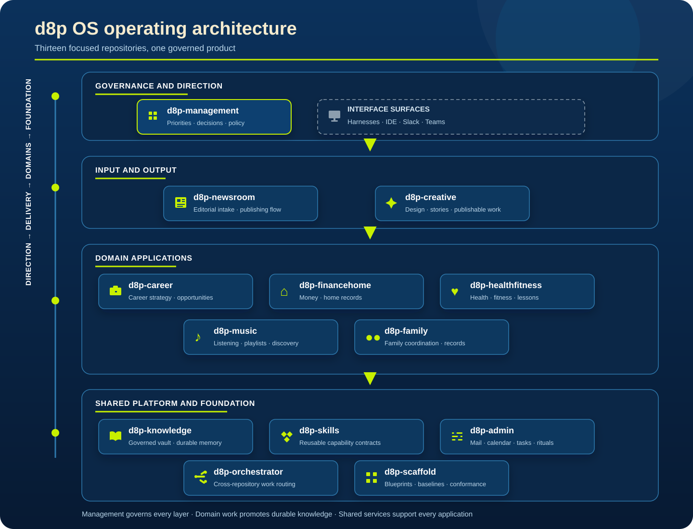

  

# d8p OS

**A governed personal operating system built from thirteen focused repositories that work as one product.** d8p OS turns scattered information and recurring work into reusable workflows while keeping decisions, permissions, and human judgment visible.

  <a href="#why-it-exists">Why it exists</a> ·
  <a href="#architecture">Architecture</a> ·
  <a href="#repository-map">Repository map</a> ·
  <a href="#public-and-private-boundaries">Boundaries</a>

## Why it exists

d8p OS is a laboratory for ongoing experimentation that also delivers practical, incremental value in daily life. It tests how content architecture, product governance, durable memory, agent workflows, and reusable automation can operate as one coherent system instead of a collection of disconnected tools.

The system stays useful by separating responsibilities. Management sets direction, publishing services shape inputs and outputs, domain applications keep work close to its records, and a shared platform supplies memory, skills, orchestration, administration, and consistent repository structure.

## Architecture

The operating model moves from direction to delivery to domain work, with the shared platform supporting every layer.

## Repository map

The map follows the architecture above: direction first, delivery next, domain work at the center, and shared services beneath every application.

### Governance and direction

<table>
  <tr>
    <td width="50%" valign="top"><strong>d8p-management</strong><ul><li>GitHub Issues and Projects carry the governed backlog.</li><li>Markdown decision records preserve policy and rationale.</li><li>GitHub Actions automate bounded governance checks.</li></ul></td>
    <td width="50%" valign="top"><strong>Interface surfaces</strong><ul><li>Claude Code, Codex, and Copilot provide execution harnesses.</li><li>VS Code and Obsidian support code and knowledge work.</li><li>Slack and Teams extend conversational access.</li></ul></td>
  </tr>
</table>

### Input and output

<table>
  <tr>
    <td width="50%" valign="top"><strong>d8p-newsroom</strong><ul><li>KnowCapture connectors collect curated source material.</li><li>Deterministic pipelines summarize, classify, and tag.</li><li>MCP queries and a human gate control promotion.</li></ul></td>
    <td width="50%" valign="top"><strong>d8p-creative</strong><ul><li>Quartz turns governed Markdown into public and protected sites.</li><li>TypeScript components carry the shared design system.</li><li>Cloudflare Pages supplies preview and publishing infrastructure.</li></ul></td>
  </tr>
</table>

### Domain applications

<table>
  <tr>
    <td width="33%" valign="top"><strong>d8p-career</strong><ul><li>Structured Markdown keeps opportunities and portfolio evidence legible.</li><li>Node.js and Google APIs render calendar-aware daily briefs.</li><li>Python regression checks protect discovery workflows.</li></ul></td>
    <td width="34%" valign="top"><strong>d8p-financehome</strong><ul><li>Plain-text records form a durable household filing cabinet.</li><li>Python scanners block sensitive data before saves and commits.</li><li>Rocket Money exports, Gmail intake, and GitHub Actions feed guarded reports.</li></ul></td>
    <td width="33%" valign="top"><strong>d8p-healthfitness</strong><ul><li>Apple Health and workout exports supply private metrics.</li><li>Strava, Withings, FitBody, and MyChart remain source systems.</li><li>Manual review keeps raw health data out of shared knowledge.</li></ul></td>
  </tr>
  <tr>
    <td width="33%" valign="top"><strong>d8p-music</strong><ul><li>The Spotify API drives playlist and listening workflows.</li><li>MCP read queries support governed discovery.</li><li>Scrubbed public patterns separate reusable logic from preferences.</li></ul></td>
    <td width="34%" valign="top"><strong>d8p-family</strong><ul><li>Structured records keep family coordination in context.</li><li>Read-only calendar data arrives through d8p-admin.</li><li>MCP queries preserve an A0, human-directed boundary.</li></ul></td>
    <td width="33%" valign="top"><em>Domain records stay close to the work; only generalized lessons move into durable shared knowledge.</em></td>
  </tr>
</table>

### Shared platform and foundation

<table>
  <tr>
    <td width="33%" valign="top"><strong>d8p-knowledge</strong><ul><li>Obsidian-compatible Markdown is the canonical knowledge source.</li><li>Python and JSON Schema validate governed records.</li><li>SQLite search and Quartz projections make knowledge usable.</li></ul></td>
    <td width="34%" valign="top"><strong>d8p-skills</strong><ul><li>Agent Skills Markdown and YAML define reusable capability contracts.</li><li>Python and shell provide deterministic checks and installers.</li><li>Symlinks distribute one source across Claude, Codex, and Copilot.</li></ul></td>
    <td width="33%" valign="top"><strong>d8p-admin</strong><ul><li>Obsidian Tasks and periodic notes drive personal rituals.</li><li>Python validates connector contracts against JSON Schema.</li><li>Gmail, Google Calendar, Tasks, Reclaim, and GitHub stay read-only by default.</li></ul></td>
  </tr>
  <tr>
    <td width="33%" valign="top"><strong>d8p-orchestrator</strong><ul><li>Pydantic AI 2.0 supplies the governed crew pattern.</li><li>MCP contracts route work across repositories and tools.</li><li>Autonomy levels and approval gates keep execution bounded.</li></ul></td>
    <td width="34%" valign="top"><strong>d8p-scaffold</strong><ul><li>Copier and Jinja render the shared repository blueprint.</li><li>YAML questionnaires preserve repository-specific values.</li><li>Python and GitHub API checks audit conformance and drift.</li></ul></td>
    <td width="33%" valign="top"><em>The platform supplies memory, reusable behavior, routing, operations, and a consistent foundation.</em></td>
  </tr>
</table>

## Public and private boundaries

This page is the public architecture snapshot. The repositories, working records, decision history, and detailed component documentation remain private so the system can safely contain personal operations and continue changing in the open-ended way a laboratory requires.

  
  &nbsp;<a href="https://github.com/danielbpatton/d8p-knowledge/blob/main/knowledge-vault/d8p-os-docs/d8p-os-stack/index.md#Operating">Open the private architecture vault</a> 
  Authorized GitHub access is required. Project records and working documentation are not public.

[Return to Daniel Patton’s profile](https://github.com/danielbpatton)
